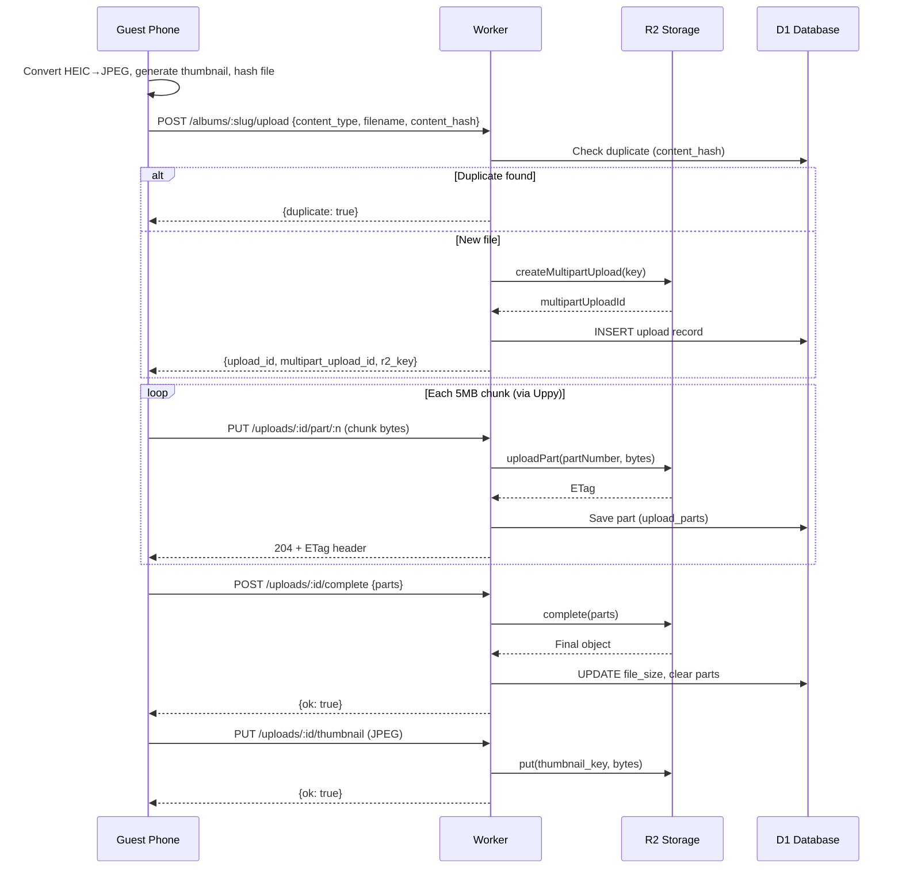
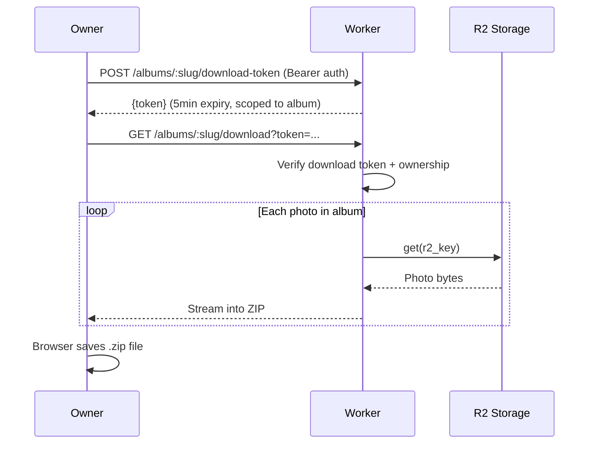
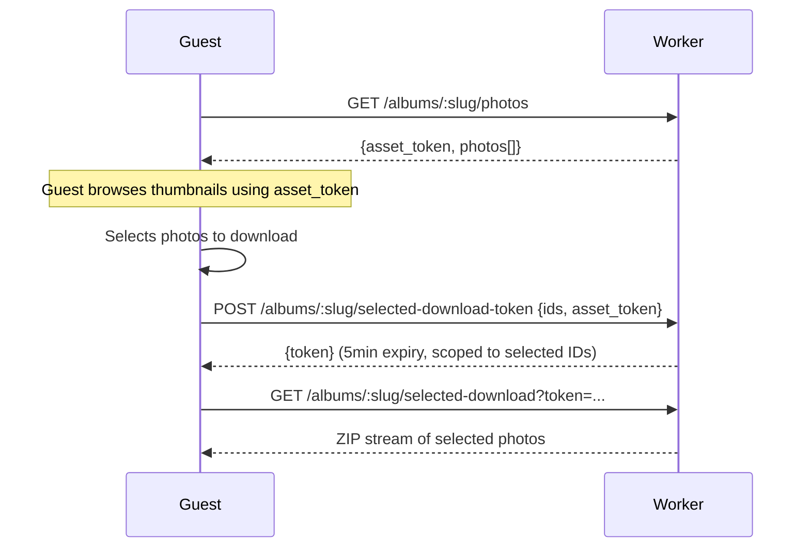
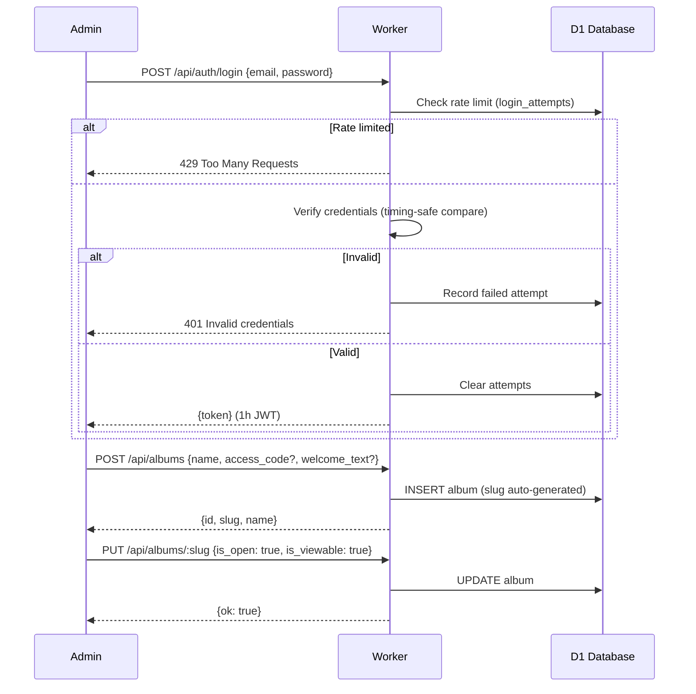
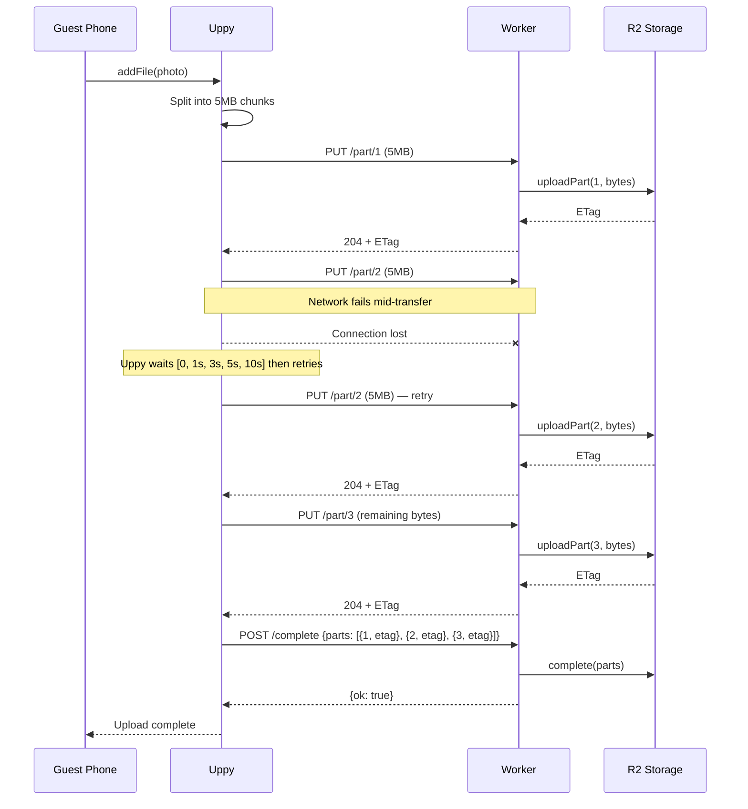

# Sequence Diagrams

## Guest uploads a photo

## Owner downloads all photos

## Guest views gallery and downloads selected photos

## Admin login + album creation

## Multipart upload retry flow

